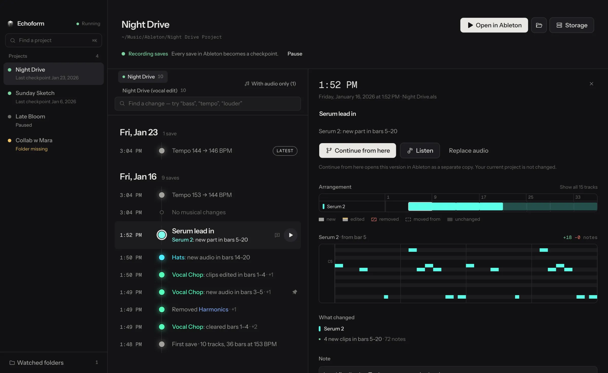

# Echoform

**Every Ableton save, kept.**

Echoform keeps a copy of your Ableton project each time you save, tells you
what changed in plain words, and opens any earlier version as a separate copy
without touching the one you're working on.



**[Download the latest release](https://github.com/Mergemat/echoform/releases/latest)**
for macOS (Apple silicon and Intel) or Windows. Free and open source (GPL-3.0).

## How it works

1. **Point it at your projects folder.** Echoform finds every Ableton project
   inside, including ones you create later. Nothing in the folder is moved or
   changed.
2. **Work as usual.** Each time you save in Ableton, Echoform stores a full
   copy of the project, samples included, in its own history. Files that
   didn't change between saves are stored once.
3. **See what changed.** Every save gets one line in words, like
   `Serum 2: new part in bars 5–20` or `Kick louder (+2.0 dB)`. Open a save to
   see the arrangement with new, edited, moved and removed clips, a piano roll
   of the notes that changed, and every device, mixer and automation change.
4. **Find the moment.** Search the history for a track, a device or a word
   like `tempo` or `louder` to see every save where that changed.
5. **Go back safely.** *Continue from here* rebuilds any save as a separate
   project, checks every file, and opens it in Ableton. The project you're
   working on stays exactly as it is.

Each `.als` file in a project (for example after *Save As*) gets its own
history.

## What it reads from a Live Set

| Reads | Doesn't read (yet) |
| --- | --- |
| Arrangement clips: position, MIDI notes, audio samples | Audio itself (no waveform comparison) |
| Devices and plug-ins, on/off, parameter values | Plug-in settings Ableton doesn't expose as parameters (reported as "plug-in state changed") |
| Volume and sends in dB, pan, mute, solo | Contents of Session View clips (only how many there are) |
| Automation lanes, tempo, time signature, locators | |

Live's own bookkeeping (renumbered ids, warp timings recalculated after a
tempo change, auto-numbered track names) is ignored, so a save where nothing
musical happened says so: *No musical changes*.

## Your data

- **Everything stays on your computer.** History lives in Echoform's app data
  folder (`~/Library/Application Support/Echoform` on macOS,
  `%APPDATA%\Echoform` on Windows). Copies made with *Continue from here* go
  to `~/Music/Echoform Recoveries`.
- **It's version history, not a backup.** If the drive fails, the history
  goes with it. Keep backing up as usual.
- **Long histories are thinned out.** Once a project has more than 100
  automatic saves or 2 GB of history, older saves are thinned to one per hour,
  then one per day, then one per week. Saves you name, pin, add a note to or
  attach audio to are never removed automatically, and neither are the first
  and latest save of each set.
- **Telemetry.** Release builds send usage events such as "project opened" or
  "checkpoint restored", with counts but no names (PostHog), and crash reports
  (Sentry), whose error messages can mention file names. Project files are
  never uploaded.

## Development

Requirements: [Bun](https://bun.sh) 1.3.14. CI also uses Node 26.

```bash
bun install
bun run dev        # desktop app + background service
bun run dev:web    # marketing site
bun run check      # audit, lint, typecheck, tests and builds for everything
```

The repository is a Bun workspace:

| Path | What it is |
| --- | --- |
| `apps/desktop` | Electron shell and React UI (Vite, Tailwind, Zustand) |
| `packages/server` | Background service run by the app: watches project folders, stores history, analyzes Live Sets |
| `apps/web` | The website (Astro) |

Inside `packages/server/src`:

- `watcher.ts` notices saves; `history-store.ts` and `blob-store.ts` capture a
  deduplicated copy of the project for each save and rebuild it on recovery.
- `live-set.ts` reads an `.als` file (gzipped XML) into a model of tracks,
  clips, notes, devices, mixer and automation.
- `set-compare.ts` compares two versions and writes the summary and plain
  language lines shown in the app. Bump `ANALYSIS_VERSION` in `types.ts` when
  its output changes; stored summaries are then recomputed in the background.
- `core.ts` holds the project, save and recovery logic; `server.ts` exposes it
  over HTTP and a WebSocket to the desktop UI.

Terms used in code and UI (project, checkpoint, set, branch, working copy) are
defined in [CONTEXT.md](CONTEXT.md).

### Releases

```bash
bun run release:patch   # or release:minor / release:major
git push --follow-tags
```

- `apps/desktop/package.json` holds the app version.
- The release command bumps the version, updates `CHANGELOG.md`, commits and
  tags `vX.Y.Z`. Add `-- --push` to push in the same step, or pass an explicit
  version with `bun run release -- 1.2.3`.
- Pushing the tag makes GitHub Actions build the macOS and Windows apps and
  publish the GitHub release. The website and the in-app update check both read
  the latest release.

### Dependency audit

`bun run audit` fails on any high or critical advisory that isn't in
`.github/dependency-audit-baseline.json`. The baseline currently accepts one
advisory (`braces`, which has no patched release yet); each entry records why
it was accepted. Remove entries once a fix is available.

### Commits

[Conventional Commits](https://www.conventionalcommits.org), so the changelog
writes itself:

```text
feat(desktop): add update banner
fix(server): harden session bootstrap
chore: refresh release workflow
```

## License

[GPL-3.0](LICENSE)
